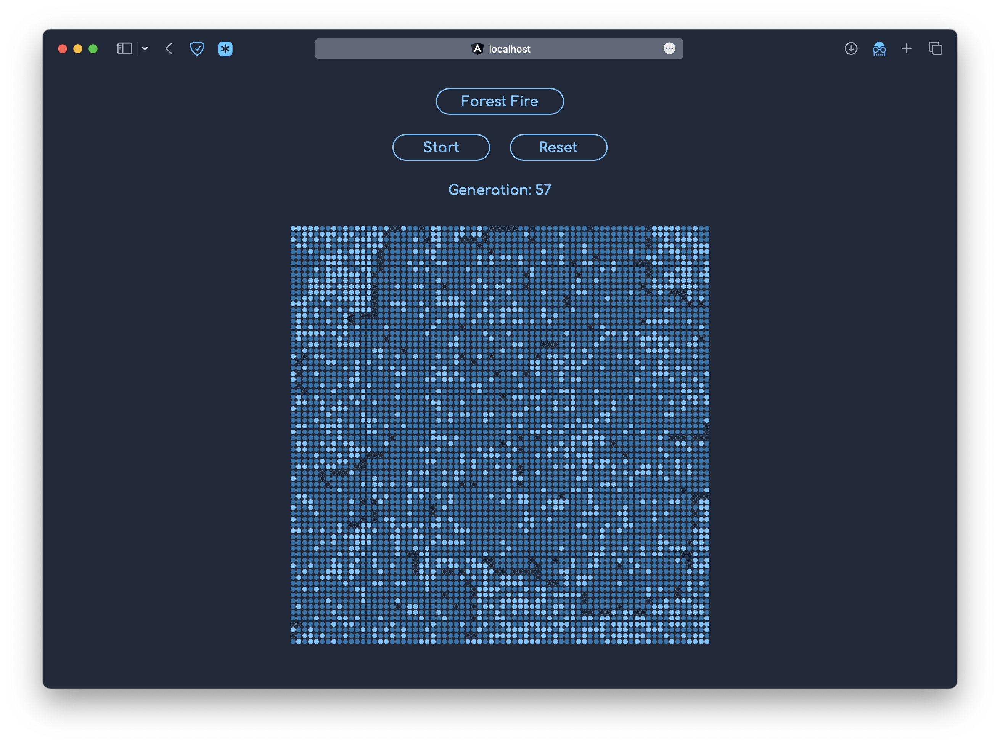

# Cellcular Automaton
A cellcular automaton including some different rules, simulating different problems.

## Running

1. Run `ng serve` to start the server. 
2. Navigate to `http://localhost:4200/`.

## Models

__Game of Life__

[Conway's Game of Life](https://en.wikipedia.org/wiki/Conway's_Game_of_Life#Algorithms)

__Forest fire simulation__

[A simple dynamical system displaying self-organized criticality](https://scipython.com/blog/the-forest-fire-model/)

__Powdery mildew infection spread in grapevines with intercropping of resistant variety__

[A simple cellular automaton of plant epidemics in Julia](https://blog.devgenius.io/a-simple-cellular-automaton-of-plant-epidemics-in-julia-29ac62d87516)

__Powdery mildew infection spread in grapevines with certain part of field of higher humidity__

A modification of the intercropping model simulating varied infection rate due to humidity difference in the field.